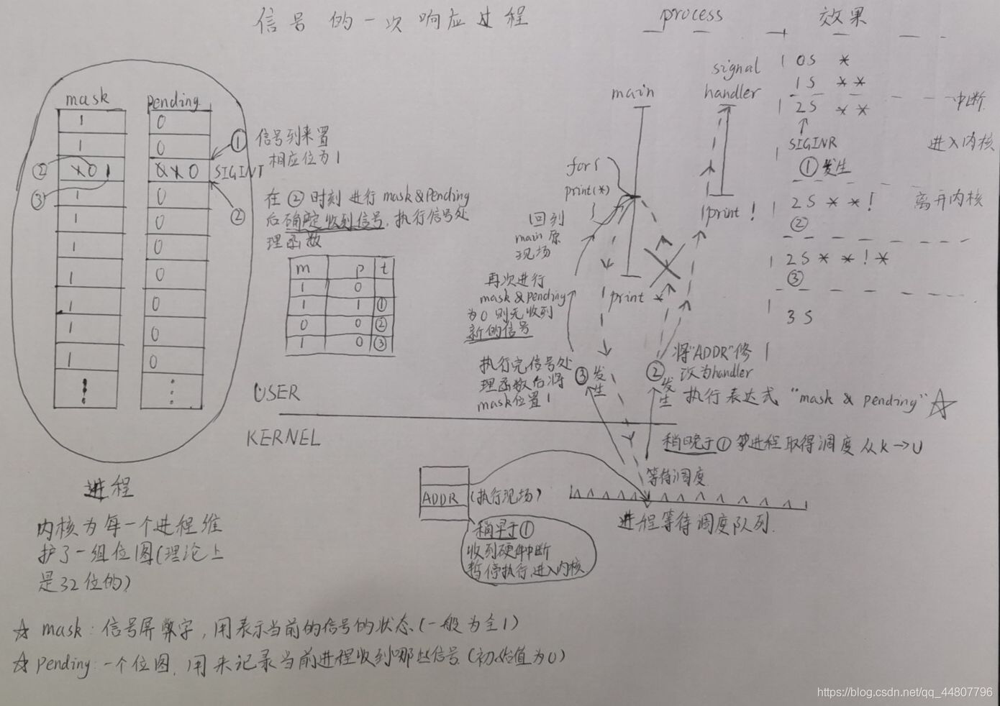

# 并发
**同步与异步**  
异步事件的处理：查询法，通知法 

## 信号
### 1. 信号的概念
  信号是软件中断。  
  信号的响应依赖于中断。
### 2. signal()
  `void (*signal(int signum,void(*func)(int)))(int);`  
  信号会打断阻塞的系统调用
### 3. 信号的不可靠
### 4. 可重入函数 
  第一次调用还未结束时发生了第二次调用但不会出错的函数
  所有系统调用都是可重入了，一部分系统调用可重入，如 `memcpy()`
- 信号处理函数中尽量用系统调用，用标准IO就可能出问题
### 5. 信号的响应过程(P66)

- 进程中有mask与pending  
- **信号只有从内核态到用户态的切换中才会被响应（需要中断）**   
- 信号从收到到响应有一个不可避免的延迟  
- 思考：如何忽略掉一个信号的？(mask对应位置0)  标准信号为什么丢失？（pending位一次性来一堆1也只能置1次）  
- **标准信号的响应没有严格的顺序**
- 不能随意从信号处理程序中往外跳（需要用sigsetjmp，siglongjmp）

### 6. 常用函数
- `kill()`**不是用来杀死进程的，是用来发送信号的，只不过大多数信号有杀死进程的作用**
- `raise()`，给自己发信号`kill(getpid(), sig);`
- `alarm()`,alarm会覆盖先前的alarm，信号默认杀死进程，**sleep与alarm不能混用**
  - 使用单一计时器，构造一组函数，实现任意数量的计时器
- `setitimer()`提供更精细的计时，误差不累计
- `pause()`,人为制造的阻塞系统调用 等待一个信号来打断它
- `abort()`
- `system()`
- `sleep()`,**在某些平台，sleep()是使用alarm+pause封装的，而程序中出现多于1个的alarmalarm将失效**ubuntu中等于nanosleep
- `usleep()`
- `select()`
- volatile 关键字
**去到这个变量真正的存储空间取数值，而不是根据局部结构判断取值**
### 7. 信号集
**信号集类型sigset_t**
- `sigemptyset()`
- `sigfillset()`
- `sigaddset()`
- `sigdelset()`
- `sigismember()`
### 8. 信号屏蔽字/pengding集的处理
- `sigprocmask()`
- `sigpending()`
### 9. 扩展
- `sigsuspend()`,**用修改屏蔽字+`pause()`来等待特定信号不是原子操作**
- `sigaction()`,**用来替换signal(),还可以指定信号的来源以选择是否响应**  
  - slowcat2（采用`signal()`）运行过程中，若从用户态传一堆alrm信号给进程，进程是没法区分信号来自kernal态还是用户态的。
- `setitimer()`
### 10. 实时信号
不会丢失 有顺序
## 线程